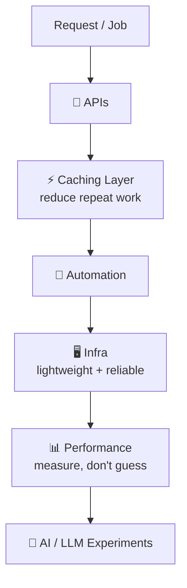
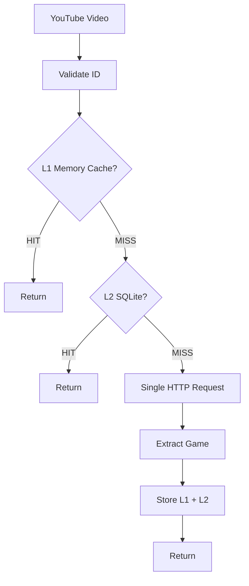
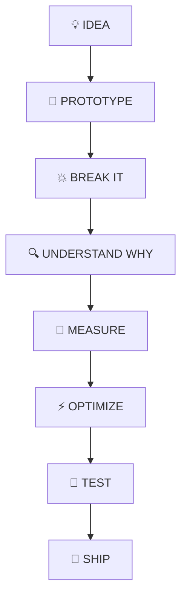
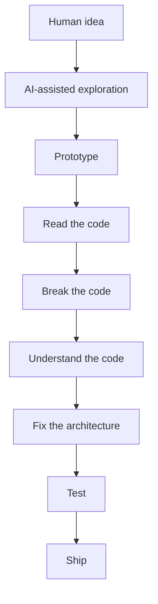

<!-- ╔══════════════════════════════════════════════════════════════╗ -->
<!--  DEV · @itsmobsys · GitHub Profile Portfolio                    -->
<!--  Stack: Python · JavaScript · Linux · Backend · Performance      -->
<!-- ╚══════════════════════════════════════════════════════════════╝ -->


<div align="center">

  
  
  

  <br /><br />

  <h1>⚡ HEY, I'M DEV</h1>

  <h3><code>@itsmobsys</code></h3>

  <p><strong>I build things because I want to know how they work.</strong></p>

  <p>
    <sub>real projects · weird problems · performance · automation · backend</sub>
  </p>

  <a href="https://github.com/itsmobsys">
    
  </a>
  <a href="https://github.com/itsmobsys?tab=repositories">
    
  </a>
  <a href="https://github.com/itsmobsys/Game-sorting-for-clipwave">
    
  </a>

  <br /><br />

  

  <br />

  <p>
    
    
    
    
    
    
  </p>

  <p>
    <sub>
      <a href="#-about-me">About</a> ·
      <a href="#-featured-project">Featured</a> ·
      <a href="#-tech-stack">Stack</a> ·
      <a href="#-my-engineering-philosophy">Philosophy</a> ·
      <a href="#-how-i-build">Workflow</a> ·
      <a href="#-projects">Projects</a> ·
      <a href="#-github-dashboard">Stats</a>
    </sub>
  </p>

</div>

---

<div align="center">

### Fast · Lightweight · Reliable · Maintainable · Actually useful

</div>

# 🧠 About Me

I'm a developer who enjoys building **real projects**, solving **weird problems**, **optimizing things that probably didn't need optimizing**, and then finding out **why everything broke**.

I like working on software where the interesting part isn't just the UI. The stuff underneath matters too — caching, APIs, concurrency, resource usage, failure modes.

<div align="center">

<table>
<tr>
<td align="center"><strong>🔨 Build</strong><br /><sub>real things, not demos</sub></td>
<td align="center"><strong>💥 Break</strong><br /><sub>on purpose, to learn</sub></td>
<td align="center"><strong>🔍 Understand</strong><br /><sub>why it broke</sub></td>
<td align="center"><strong>⚡ Optimize</strong><br /><sub>measure, then fix</sub></td>
</tr>
</table>

</div>

```text
┌───────────────────────────────────────────────────┐
│                    HOW I BUILD                    │
├───────────────────────────────────────────────────┤
│                                                   │
│   idea                                            │
│    ↓                                              │
│   prototype                                       │
│    ↓                                              │
│   break it                                        │
│    ↓                                              │
│   understand why                                  │
│    ↓                                              │
│   optimize                                        │
│    ↓                                              │
│   test it                                         │
│    ↓                                              │
│   ship it                                         │
│                                                   │
└───────────────────────────────────────────────────┘
```

> I don't particularly care about writing the **most** code. I'd rather write less code that does less unnecessary work.

---

# 🚧 What I'm Focused On

<div align="center">


**Backend systems that are lightweight, cached, and measured — not guessed.**

`caching` → `APIs` → `automation` → `infra` → `performance`

</div>

I'm most interested in the stuff underneath the UI:

| System | What I work on |
| :--- | :--- |
| ⚡ **Caching** | Reducing unnecessary requests |
| 🔌 **APIs** | Connecting systems together |
| 🤖 **Automation** | Making repetitive work disappear |
| 🧠 **AI / LLMs** | Experimenting with useful AI workflows |
| 🖥️ **Infrastructure** | Keeping things lightweight and reliable |
| 📊 **Performance** | Measuring instead of guessing |

### 🗺️ How I think about systems



<details>
<summary><strong>🧩 View as terminal map (same idea, text version)</strong></summary>

```text
                Request / Job
                      │
                      ▼
                 APIs (glue)
                      │
                      ▼
               Caching layer
            (avoid repeat work)
                      │
                      ▼
            Automation + Infra
         (lightweight + reliable)
                      │
                      ▼
           Performance + AI tests
          (measure, then experiment)
```

</details>

<details>
<summary><strong>⚙️ What “infrastructure” means here</strong></summary>

- Get it **correct before making it fast** — then make it cheap.
- Caching sits in front of repeated work — if we already know the answer, don't recompute it.
- Automation removes the repetitive glue so the system stays maintainable.
- Measure real behavior — resource usage, failure modes, bottlenecks — instead of guessing.

</details>

---

# 🎮 Featured Project

<div align="center">


### YouTube video → game detection → cached result

**A lightweight Python module that identifies the game associated with a YouTube video — without throwing a giant stack of dependencies at the problem.**

  <a href="https://github.com/itsmobsys/Game-sorting-for-clipwave">
    
  </a>

</div>

## Problem → Approach → Architecture → Optimization → Testing → Result

| Step | Question it answers |
| :--- | :--- |
| **1. Problem** | How do we detect a game without a browser, without an LLM, without bloat? |
| **2. Approach** | Validate → check memory → check disk → fetch once → extract → store |
| **3. Architecture** | L1 memory + L2 SQLite + single-flight HTTP |
| **4. Optimization** | Coalesce callers, bound concurrency, TTL everything |
| **5. Testing** | Automated tests + resource measurements |
| **6. Result** | Predictable, lightweight, graceful under failure |

<div align="center">

**`Problem ↓ Approach ↓ Architecture ↓ Optimization ↓ Testing ↓ Result`**

</div>

### ✨ The design



<details>
<summary><strong>📟 Same flow as terminal diagram</strong></summary>

```text
                  YouTube Video
                        │
                        ▼
                 Validate ID
                        │
                        ▼
                 L1 Memory Cache
                    │       │
                  HIT       MISS
                    │       │
                    ▼       ▼
                 Return   L2 SQLite
                              │
                         ┌────┴────┐
                         │         │
                        HIT       MISS
                         │         │
                         ▼         ▼
                      Return   HTTP request
                                   │
                                   ▼
                              Extract game
                                   │
                                   ▼
                              Store result
                                   │
                                   ▼
                                Return
```

</details>

### 🔥 Things I specifically cared about

<div align="center">

| | | |
| :--- | :--- | :--- |
| ✅ No browser automation | ✅ No LLM calls | ✅ Minimal dependencies |
| ✅ Two-level caching | ✅ SQLite persistence | ✅ Request coalescing |
| ✅ Bounded concurrency | ✅ TTL-based expiration | ✅ Graceful failures |
| ✅ Automated tests | ✅ Resource measurements | ✅ Predictable memory usage |

</div>

### 🧪 The interesting part — request coalescing

When multiple callers ask for the **same video simultaneously**, they shouldn't all independently hit YouTube.

Instead:

```text
Caller 1 ─┐
Caller 2 ─┤
Caller 3 ─┼──► ONE HTTP REQUEST
Caller 4 ─┤
Caller 5 ─┘
                 │
                 ▼
             Shared result
```

That's the sort of optimization I enjoy finding — **one request does the work, everyone shares the result, the cache makes the next call free.**

<details>
<summary><strong>🔬 Engineering decisions (expand)</strong></summary>

- **No browser:** launching a browser for something solvable with one HTTP request is waste.
- **No LLM:** classification here doesn't need inference — it needs parsing + caching.
- **L1 + L2:** memory for speed, SQLite for persistence across restarts.
- **TTLs:** cached truth goes stale — expire it on purpose instead of serving lies forever.
- **Bounded concurrency:** parallelism without a limit is just a slower DDoS against yourself.
- **Graceful failure:** upstream fails → return something sane, don't take the whole system down.
- **Tests + measurements:** RAM, behavior under concurrent load, weird IDs — tested, not assumed.

</details>

<div align="center">

<a href="https://github.com/itsmobsys/Game-sorting-for-clipwave">
  
</a>

</div>

---

# 🛠️ Tech Stack

<div align="center">
<sub>everything below is stuff I actually use or am actively exploring — no filler</sub>
</div>

### Languages

<p align="center">
  
  
  
  
  
  
</p>

### Frontend

<p align="center">
  
  
  
  
  
</p>

### Backend

<p align="center">
  
  
  
  
  
  
</p>

### Databases & Storage

<p align="center">
  
  
  
  
  
</p>

### APIs & Integrations

<p align="center">
  
  
  
  
</p>

### DevOps & Cloud

<p align="center">
  
  
  
  
  
  
</p>

### Linux & OS

<p align="center">
  
  
  
  
  
</p>

### Testing & Code Quality

<p align="center">
  
  
  
  
</p>

### Developer Tools

<p align="center">
  
  
  
  
</p>

### Architecture & Practices

```text
REST APIs · Async Programming · Caching Strategies · Request Coalescing
Background Workers · Rate Limiting · Database Design · Error Handling
Logging & Monitoring · CI/CD Pipelines
```

### Currently Exploring

```text
AI / LLMs · Cloud Infrastructure · Backend Architecture
Performance Engineering · Automation · Distributed Systems
Linux Internals · Developer Tooling · React Ecosystem
Container Orchestration · Observability · Security Best Practices
```

---

# ⚙️ My Engineering Philosophy

I like solving problems that look something like this:

```text
          BEFORE

     Request arrives
            │
            ▼
      Do expensive thing
            │
            ▼
      Do expensive thing
            │
            ▼
      Do expensive thing
            │
            ▼
        Return result


          AFTER

     Request arrives
            │
            ▼
       Check memory
            │
       ┌────┴────┐
       │         │
      HIT       MISS
       │         │
       ▼         ▼
    Return     Check DB
                 │
            ┌────┴────┐
            │         │
           HIT       MISS
            │         │
            ▼         ▼
         Return    One request
                       │
                       ▼
                    Cache it
                       │
                       ▼
                    Return
```

And when something does need to be complicated, I want to know **why**.

```text
less code
   ↓
less complexity
   ↓
less work
   ↓
less resource usage
   ↓
fewer failure points
```

## 🧪 Things I Like Optimizing

### 🌐 Network

```text
Can I avoid the request?
        ↓
Can I cache the result?
        ↓
Can requests share the same work?
        ↓
Can concurrency be bounded?
        ↓
Can failure be graceful?
```

### 💾 Memory

```text
How much RAM does this actually use?

Not:
    "It should be fine."

But:
    measure it
    test it
    stress it
    find the limit
```

### ⚡ Performance

> **"It feels faster" isn't a measurement.**

I like benchmarks because feelings don't scale. Numbers do — as long as you're measuring the right thing.

---

# 🔁 How I Build

<div align="center">


➜

➜

➜

➜

➜

➜

➜


</div>



<details>
<summary><strong>📟 Terminal version of the loop</strong></summary>

```bash
$ build --idea "clip youtube fast"
[1/8] prototype ......... done
[2/8] break it .......... done (of course)
[3/8] understand why .... reading logs at 2am
[4/8] measure ........... no guessing, numbers only
[5/8] optimize .......... cache > repeat
[6/8] test .............. weird cases included
[7/8] ship .............. people can actually use it
[8/8] repeat ............ more bugs, more learning
```

</details>

---

# 🔬 A Few Rules I Try To Follow

```text
┌──────────────────────────────────────────────┐
│  01  Measure before optimizing               │
│  02  Cache before repeating work             │
│  03  Fail gracefully                         │
│  04  Keep dependencies intentional           │
│  05  Prefer simple systems                   │
│  06  Test the weird cases                    │
│  07  Understand the bottleneck               │
│  08  Don't optimize imaginary problems       │
│  09  Automate repetitive work                │
│  10  Ship things people can actually use     │
└──────────────────────────────────────────────┘
```

## 🧰 My Favorite Kind of Problem

Something nobody notices until you look closely.

For example:

```text
"Why are we making 10,000 requests?"

"Why does this use 500 MB?"

"Why are five workers doing the same thing?"

"Why does this work until two users arrive?"

"Why are we launching a browser for something
that could be solved with one HTTP request?"
```

Those are fun problems.

---

# 🤖 AI & Development

I use AI as a **tool**, not as a replacement for understanding the software.

My preferred workflow is roughly:



```text
Human idea
    ↓
AI-assisted exploration
    ↓
Prototype
    ↓
Read the code
    ↓
Break the code
    ↓
Understand the code
    ↓
Fix the architecture
    ↓
Test
    ↓
Ship
```

The goal isn't to generate more code. The goal is to **build better software faster** — while still knowing how every important piece works, why it's shaped that way, and what happens when it fails.

<div align="center">

| AI helps with | I still own |
| :--- | :--- |
| exploration + boilerplate | architecture decisions |
| debugging hypotheses | performance tradeoffs |
| test scaffolding | final code review |
| docs + automation | shipping responsibility |

</div>

---

# 🧩 Projects

| Project | What it does | Technology | Interesting technical detail |
| :--- | :--- | :--- | :--- |
| 🎮 **Game Sorting** | Lightweight YouTube game detection → cached result | Python · SQLite · Caching | L1 + L2 cache, request coalescing, bounded concurrency, TTLs — no browser, no LLM |
| 🌐 **boink_2068** | Personal website / experimental web project | JavaScript · Web | Playground for trying web ideas fast and breaking them safely |

More experiments, tools and projects will keep appearing here as I build them.

<div align="center">

<a href="https://github.com/itsmobsys?tab=repositories">
  
</a>
<a href="https://github.com/itsmobsys/Game-sorting-for-clipwave">
  
</a>

</div>

---

# 📊 GitHub Dashboard

<div align="center">

<table>
<tr>
<td align="center" width="50%">
<strong>📈 Stats</strong><br />

</td>
<td align="center" width="50%">
<strong>🧠 Top Languages</strong><br />

</td>
</tr>
<tr>
<td align="center" colspan="2">
<strong>🔥 Streak</strong><br />

</td>
</tr>
</table>

</div>

## 📈 Contribution Graph

<div align="center">


</div>

---

# 🧠 What I'm Learning

I'm constantly working on becoming better at:

<div align="center">

| Area | Why it matters to me |
| :--- | :--- |
| 🏛️ **Software architecture** | Bigger systems need cleaner boundaries |
| 🔧 **Backend engineering** | APIs, caches, workers, and databases |
| 🐧 **Linux internals** | Understand what the machine is really doing |
| ☁️ **Cloud infrastructure** | From laptop prototype → reliable service |
| ⚡ **Performance optimization** | Measure, cache, coalesce, repeat |
| 🤖 **AI-assisted development** | Better software, faster — without losing understanding |
| 🤖 **Automation** | Repetitive work should disappear |
| 🏗️ **Building larger systems** | Prototypes are easy, systems are hard |
| 🛠️ **Maintaining projects** | Software lives after the first commit |
| 🔁 **Prototypes → reliable software** | Turning experiments into things people can use |

</div>

```text
AI / LLMs · Cloud Infrastructure · Backend Architecture
Performance Engineering · Automation · Distributed Systems
Linux Internals · Developer Tooling · React Ecosystem
Container Orchestration · Observability · Security Best Practices
```

---

# 🌱 Still Building

I'm still early in the journey, which means there is a lot left to learn.

There will be:

```text
more projects
more bugs
more experiments
more optimizations
more terrible ideas
more surprisingly good ideas
```

And hopefully, a lot more things worth showing here.

> Curiosity + questionable amounts of debugging + probably too many optimizations.

---

# 📌 Explore

<div align="center">

<a href="https://github.com/itsmobsys?tab=repositories">
  
</a>
<a href="https://github.com/itsmobsys/Game-sorting-for-clipwave">
  
</a>
<a href="https://github.com/itsmobsys">
  
</a>

<br />

<sub>start with <a href="https://github.com/itsmobsys/Game-sorting-for-clipwave">Game Sorting</a> if you want the most technical read — then dig through the rest.</sub>

</div>

---

<div align="center">

### 💭 "Build it. Break it. Understand it. Make it better."

<br />

<sub>
Made with curiosity, questionable amounts of debugging, and probably too many optimizations.
</sub>

<br /><br />


</div>
